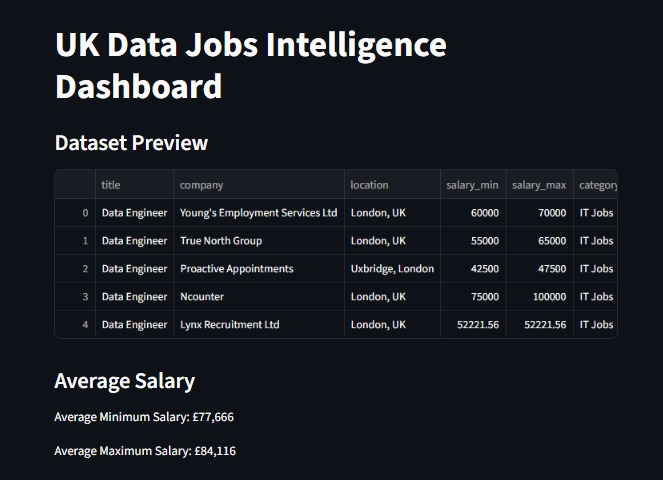
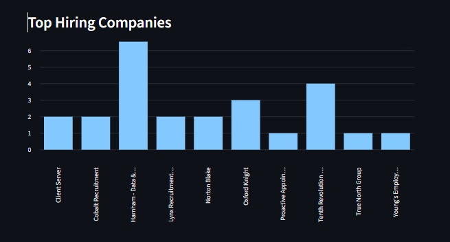
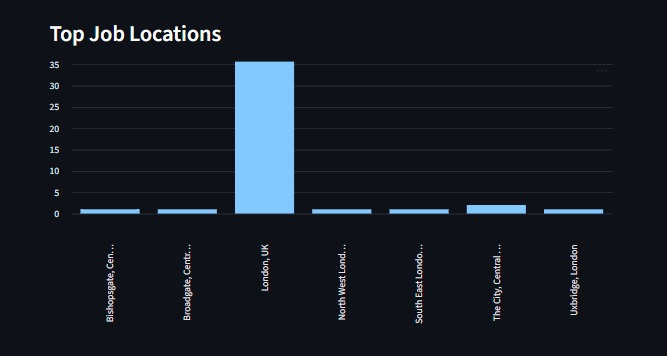

# UK Data Jobs Intelligence Platform


---

## Project Overview

The UK Data Jobs Intelligence Platform is a data project that explores trends in the UK data engineering job market.

The system collects publicly available job postings using the Adzuna Jobs API, processes and organizes the data through a structured workflow, and presents insights through an interactive dashboard.

The aim of the project is to demonstrate how raw job market data can be transformed into useful insights through a data pipeline and visualization process.

---

## Dashboard Preview

Below is a preview of the interactive dashboard built using Streamlit.




---

## Project Goal

This project analyzes trends in the UK data engineering job market to understand:

- Salary ranges for data engineering roles
- Companies that frequently hire data engineers
- Locations with the highest number of data jobs

The project demonstrates how publicly available data can be used to generate meaningful insights about industry hiring patterns.

---

## Data Source

The dataset used in this project comes from the **Adzuna Jobs API**.

Adzuna aggregates job listings from multiple job boards and recruitment platforms.

Data used in this project is intended strictly for **educational and analytical purposes**.

All credit for the job listing data belongs to:

Adzuna Ltd  
https://developer.adzuna.com/

This project does not claim ownership of the original job posting data.

---

## Project Workflow

The project follows a structured data workflow:

```

Adzuna Jobs API
↓
Data Collection
↓
Data Preparation
↓
Structured Dataset
↓
Data Analysis
↓
Interactive Dashboard

```

---

## Key Insights Generated

Using the dataset, the project highlights insights such as:

- Average salary ranges for data engineering roles
- Companies that are hiring most frequently
- Locations with the highest job demand
- Overall hiring patterns in the UK data job market

These insights are presented through a simple interactive dashboard.

---

## Technologies Used

The project uses the following technologies:

- Python
- Pandas
- SQL
- Streamlit
- Git & GitHub

---

## Future Improvements

This project will be extended to include a cloud-based architecture using Microsoft Azure services.

Planned improvements include:

- Cloud data storage
- Automated data pipelines
- Scalable data processing
- Cloud-based analytics and visualization

These improvements will transform the project into a production-style cloud data pipeline.

---

## Author

**Sohali Chandra**  
Data Engineer / Data Analyst  
sohalichandra98@gmail.com  
MSc Data Science – University of Surrey, UK  